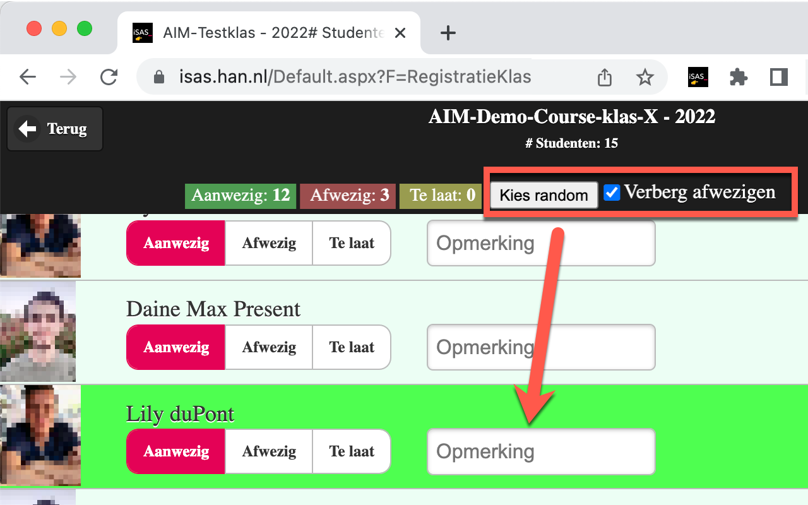
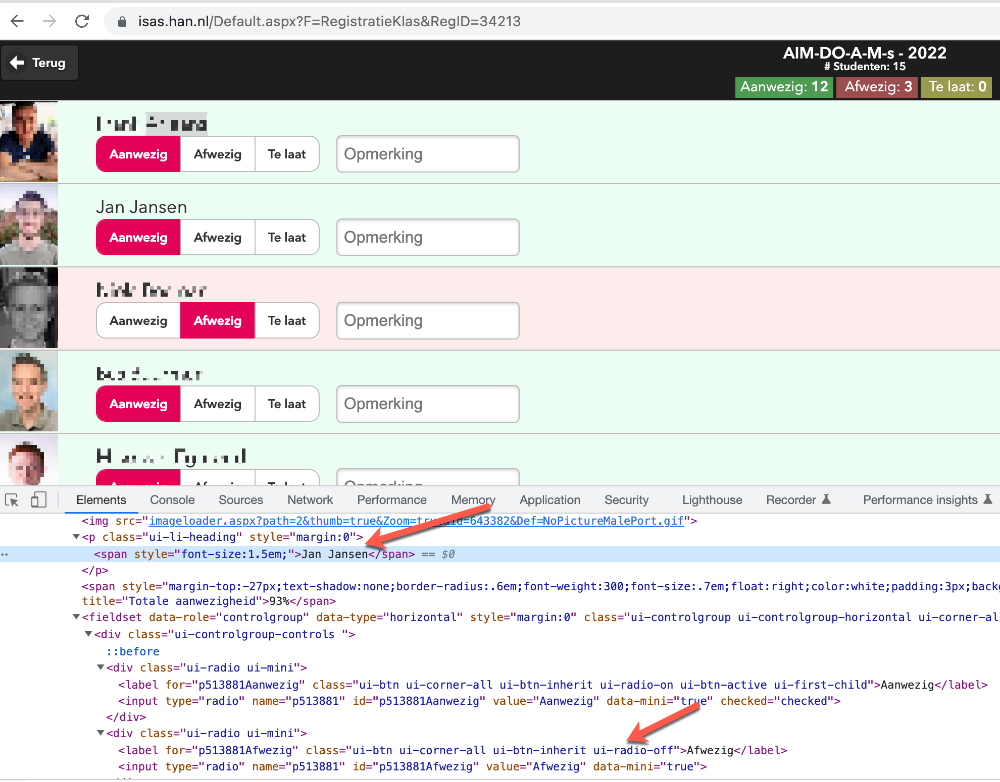
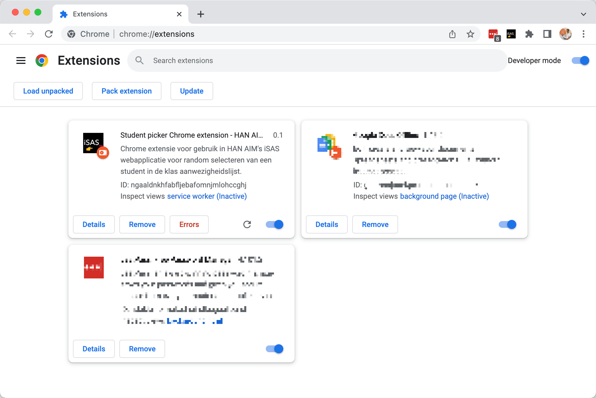
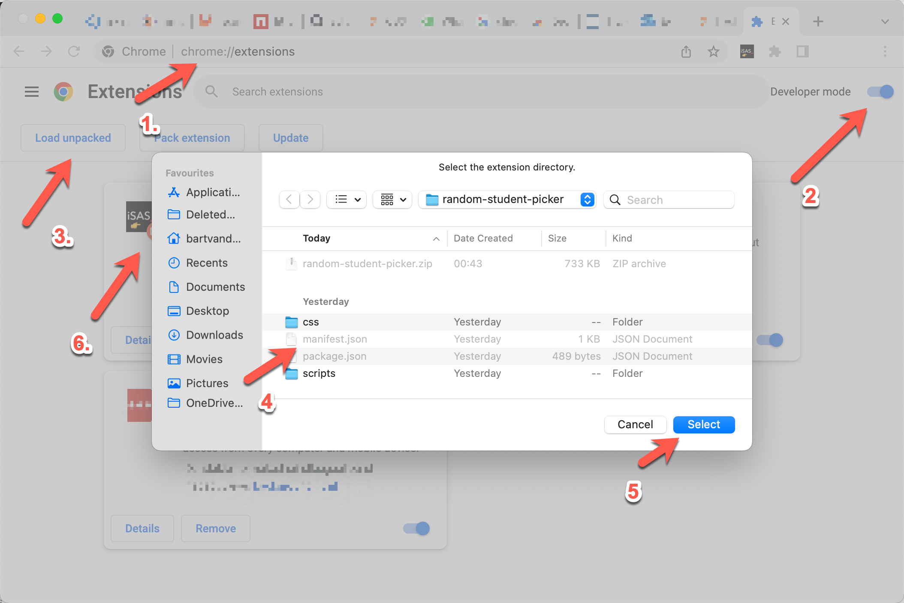

# AIM iSAS Student picker extension v0.1

Een Chrome browser extensie om in het aanwezigheidsregistratie scherm van de iSAS webapplicatie die we bij HAN AIM gebruiken optie te hebben voor 'random student picker' analoog aan de bestaande [Processing applicatie random-student-picker' van Sander Leer](https://github.com/HANICA/select-random-student) (Leer, 2019).

Hieronder wat plaatjes en een demo video van de UI en kort de algoritmiek en wat user stories voor toekomstige uitbreiding en stabilisatie.

Wellicht komt de extensie tzt in de Chrome Web store, maar voor voorlopig kun je deze handmatig zelf installeren via uploaden van root directory met de `manifest.json` en overige (JavaScript) code erin.

Bron: [Chrome docs on extensions](https://developer.chrome.com/docs/extensions/mv3/getstarted/development-basics/)

https://user-images.githubusercontent.com/3029472/196881124-ab0b21ac-1a4b-4637-8966-7dada42cb553.mp4

*Figuur 1*: Video met voorbeeld van gebruik (uiteraard fictieve studentnamen i.v.m. AVG 😉)

*Figuur 3*: (Design) De aanwezigheidslijst in iSAS en HTML structuur en class

## Hoe te installeren

T.z.t. is deze plugin wellicht te vinden in Chrome Web store. Tot die tijd kun je handmatig installeren via downloaden van de code base hier uit GitHub, en deze als 'unpacke Je installeert dit via de Chrome extension toolbar. Je moet hier de Developer. Zie bijgevoegde screenshots en stappen. Deze zijn gemaakt onder macOS op een Mac, maar het gaat vergelijkbaar op Windows.

*Figuur 5*: Markeren van 'gepickte' student

*Figuur 6*: (Design) Markeren van 'gepickte' student

0. Download code uit github via downloaden .zip uit GitHub en uitpakken of gebruik de git cli: `git clone`
1. Open de Browser Extensions via ... menu in Chrome of surf naar `chrome://extensions`
2. Zorg dat je de Developer Modus aan hebt staan
3. Druk op de `Load unpacked` knop
4. Navigeer in de file picker naar de folder die je bij stap 0 hebt gedowload (e.g. de folder waar het bestand `manifest.json` in staat) en selecteer deze
5. Je kunt nu nog het icoontje van de extensie pinnen
6. Je bent klaar , surf nu naar het Aanwezigheidsscherm in iSAS en je hebt hier extra opties

## User stories & acceptatiecriteria (BDD stijl)

Onderstaand de user stories en acceptatie criteria in [BDD](https://cucumber.io/docs/gherkin/reference/) stijl.

### Feature: Browser based interface in iSAS als Chrome extensie
Als docent wil ik de al in iSAS ingevulde aanwezigheidslijst kunnen gebruiken in de browser in plaats van aparte applicatie te gebruiken zodat ik niet apart iets hoef op te starten (maar wel een Chrome extensie moet installeren, want 'voor niets gaat de zon op' ;)).

### Feature: Als docent wil ik in een klas random een aanwezige student kunnen laten kiezen uit de groep om een vraag te beantwoorden, zodat niet telkens dezelfde studenten aan de beurt zijn en de objectiviteit gewaarborgd blijft

Scenario: Student kiezen
Gegeven een lijst van aanwezige studenten van een klas
Wanneer ik het systeem om een student vraag
Dan geeft deze random een student uit de lijst die nog niet eerder aan de beurt is geweest

Scenario: Nog ongemarkeerde student alsnog als afwezig markeren
Gegeven dat het systeem een studentnaam geeft die per ongeluk toch afwezig is
Wanneer ik aan geef dat deze toch afwezig is
Dan markeert het systeem deze student alsnog als afwezig

Scenario: Random lijst resetten
Gegeven dat ik alle aanwezige studenten al een keer heb aangewezen
Wanneer ik weer om een nieuwe student vraag
Dan gaat het systeem opnieuw door alle aanwezigen met een nieuwe random volgorde

## Pseudo code/algoritmiek

- Zet studenten in een JS array met naam en volgnr [ {"volgnr": 1, "naam": "Jan Jansen", "aanwezig": true}, { ... } ]
- Haal afwezig studenten uit array (kopie)
- Check dat aanwezigheid is ingevuld voor alle studenten (niet undefined veld)

- Tel aantal studenten (content van spans binnen <li> met html 'class' 'ui-li-heading', zie figuur 1)
- Kies random getal 'randomVolgNr' tussen 1 en aantal studenten
- Zet een css klasse 'selected' op de pagina in gevonden random getal
- Zorg dat deze gemarkeerd is, bv. groen; zie figuur 2
- Eventueel focus zetten op dit item (met `window.scrollTo()` functie; zie voorbeeldcode in [deze SO vraag/antwoord](https://stackoverflow.com/questions/17722497/scroll-smoothly-to-specific-element-on-page#answer-39494245))
